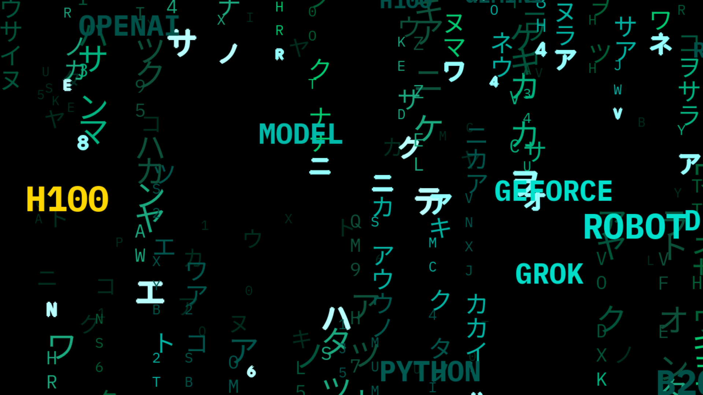

# Aria — a gentle Matrix screensaver

A calm, readable take on the classic *Matrix* digital rain, made for Rubin's
6-year-old daughter Aria so she could actually read the words floating by.

Big, slow-drifting AI words (NVIDIA, RTX, CUDA, H100, B200, Blackwell, GPU,
CHIPS…) over a smaller, slower rain — easy on young eyes, still unmistakably
"the Matrix".



## Features

- Slow, small glyph rain in the background (movie-style, with katakana where a
  CJK font is available)
- 14 full-size floating words (40–76 px) drifting slowly enough to read —
  words cycle through AI labs, **chip makers and their products**, and
  kid-friendly AI terms (ROBOT, MUSIC, BRAIN, PICTURE…)
- Cycling green → cyan → gold → violet → red palette
- Exits on any key press or mouse movement
- Resolution-aware fullscreen; `MATRIX_MONITOR` targets a specific display
- One file, no assets required — pure Python + pygame-ce

## Requirements

- Python 3.11+
- [pygame-ce](https://pypi.org/project/pygame-ce/) (`pip install pygame-ce`)

## Run it

### Any OS (Windows / macOS / Linux desktop)

```bash
pip install pygame-ce
python matrix3d_aria.py            # fullscreen on the primary display
```

Multi-monitor? Pick the display:

```bash
python matrix3d_aria.py            # display 0
MATRIX_MONITOR=1 python matrix3d_aria.py   # display 1 (e.g. a TV)
```

Exit: press any key or move the mouse.

### Omarchy (Linux, full Omarchy experience)

Omarchy is the AI-first Linux distro this was built on. The bundled
`omarchy-screensaver-aria` wrapper launches it fullscreen through a terminal
with the Wayland driver and hides the cursor while it runs:

```bash
# TV when docked (HDMI-A-1), laptop otherwise:
foot --app-id=org.omarchy.screensaver \
     --config=/usr/share/omarchy/default/foot/screensaver.ini \
     -e env MATRIX_MONITOR=1 ~/path/to/omarchy-screensaver-aria
```

Or wire it into the Omarchy menu / idle screensaver by pointing the launch
chain at this wrapper (see the comments in the wrapper).

> Windows note: the pygame core is fully cross-platform — it uses only the
> built-in word list and falls back to latin rain glyphs when no CJK font is
> installed, so nothing crashes on machines without Linux fonts.

## Customize the words

Edit the `BRAIN_WORDS` list at the top of `matrix3d_aria.py`, or drop a
`words.txt` (one word per line) next to the script / at
`~/.local/share/omarchy-matrix/words.txt` — the file wins when present.

Tuning knobs live in the header constants: `CELL_W/CELL_H` (rain geometry),
`RAIN_SIZES` (glyph sizes), rain speeds, and the floating-word count / sizes /
speeds in the word-spawn block.

## License

MIT — see [LICENSE](LICENSE). Made with ❤️ for a six-year-old who wanted to
read the words.
